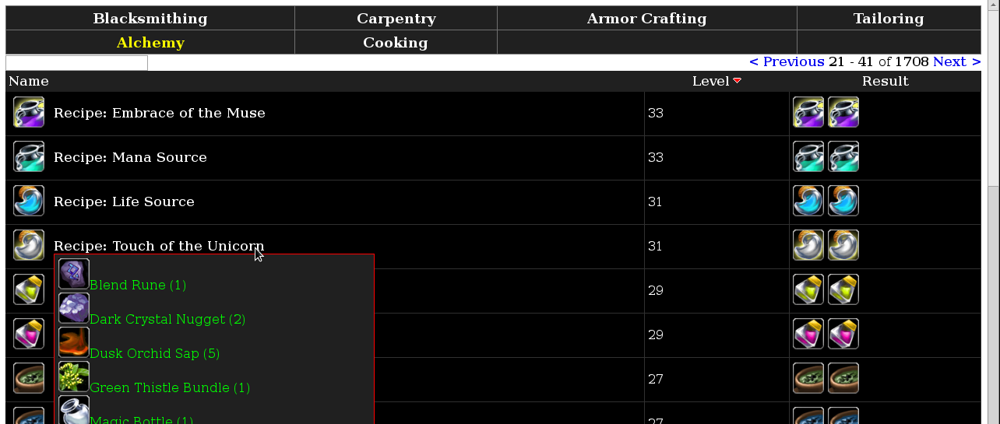
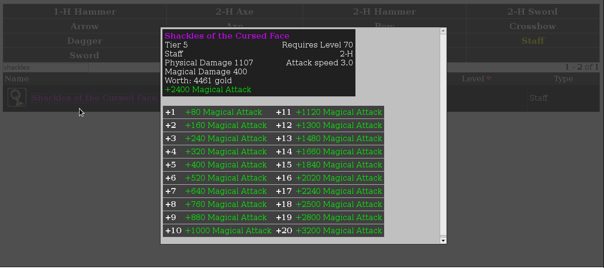
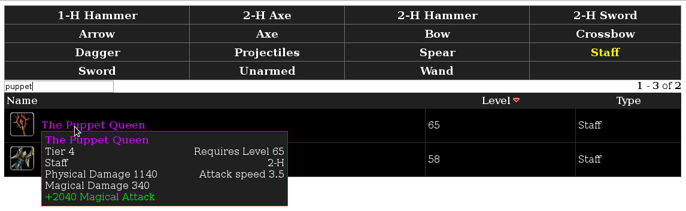

# romdb

This is a collection of tools and scripts to import, convert and present the Runes of Magic data files. Everything is licensed using the [GNU Affero Generic Public License version 3](LICENSE) - make sure you understand it before using this work.

# Screenshots







## Required software

- PostgreSQL (postgresql, postgresql-contrib)
- PHP (php5, php5-pgsql)
- Smarty (smarty)
- Python (python3, python3-lxml, python3-psycopg2)
- ImageMagick (imagemagick)

## Create the database

This must be a PostgreSQL database and must include the `citext` extension.

```
# su - postgres
$ psql
# create user romdb password 'romdb';
# create database romdb owner=romdb;
# \c romdb
# create extension citext;
```

## Import database view

```
$ cd sql
$ psql -h 127.0.0.1 -U romdb
> \i views.sql
```

## Update configuration files

These need to contain the database information and correct paths

```
$ cp scripts/lib/config.sample.py scripts/lib/config.py
$ $EDITOR scripts/lib/config.py
$ cp www/config.inc.sample.php www/config.inc.php
$ $EDITOR www/config.inc.php
```

On a stock Debian installation, using PostgreSQL connection string `dbname=romdb user=romdb password=romdb host=127.0.0.1` works correctly.

## Extract game data

You need to extract `data.fdb`. This can be done using the `fdbtool` in the `tools` directory (note that this is C++ so you will need a compiler)

```
$ cd tools/fdbtool
$ make
$ cd ../..
$ tools/fdbtool/fdbtool (path to data.fdb)
```

Alternatively, using FDB_Extractor2 will work as well to extract the data, look for it at https://github.com/McBen/FDB_Extractor2/

## Import all data

```
$ cd scripts
$ ./refresh.sh
```

This will take a while and should end up filling the database.

## Images

Converting the images requires ImageMagick. They can be created by extracting the `interface.fdb` file and using the `convert/convert-image-png.py` script to create the large PNG's. Those large images can be converted to small ones.  The whole process is among the lines of:

```
$ cd /tmp 
$ .../tools/fdbtool/fdbtool (path to interface.fdb)
$ mkdir large
$ cd .../scripts/convert
$ ./convert-image-png.py
$ cd /tmp/large
$ for i in *.png; do convert -resize 40x40 $i ../small/$i; done
```

## Open ends

This work isn't finished (mainly because I lost interest as I stopped playing the game); and this is my first serious attempt at Python and AJAX-like behaviour so some things may be messy. I've decided to release this work in an attempt to help out others study this game, create such an item database etc. I do hope it is useful.

Note that the entire process of calculating drop-chances is pure guesswork; I believe it shouldn't be too far from the truth, however...

Finally, I would like to extend my sincerest gratitude to McBen for his work on Runes of Magic; this has saved me a lot of time for which I am very grateful.

Rink Springer <rink@rink.nu>
